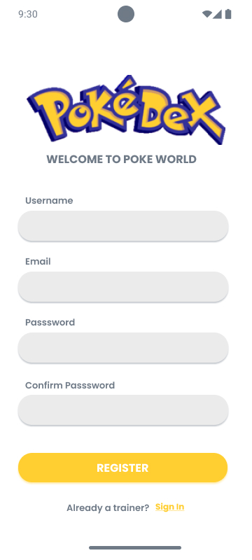

<div align="center">
  
</div>

---

<p align="center"></p>

# Preview




# Demo

<div align="center">


</div>

# Running the app

Clone/download the project and run `yarn install` to build the dependencies the project needs.

## Development

```
// Inside the downloaded folder

// To start Metro Bundler
yarn start

// Launch app on emulator or device
yarn android
yarn ios
```
